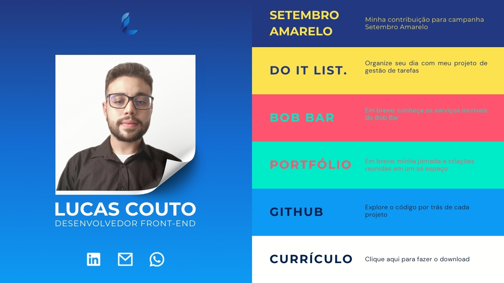
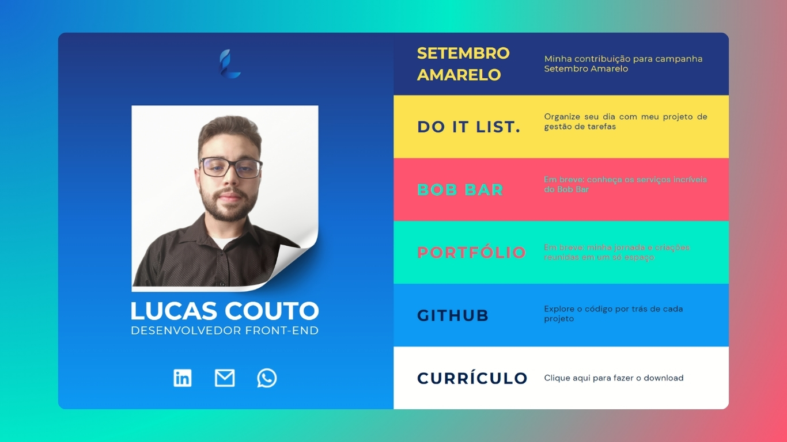
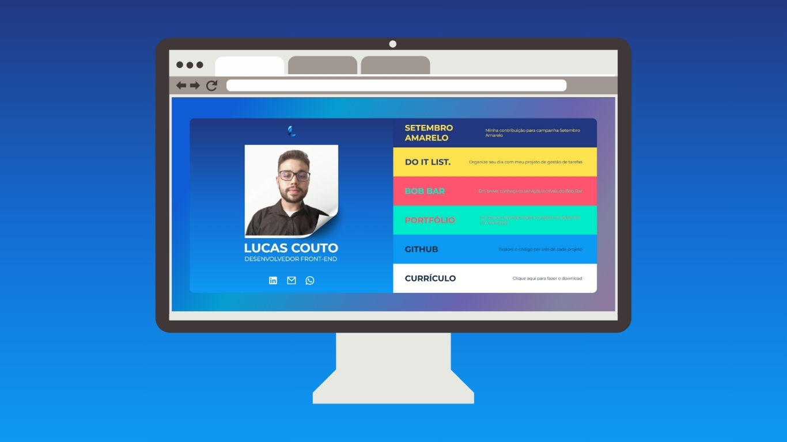

<h1 align="center">Linkverse 🌐</h1>

<div>
  
[](./LICENSE)&nbsp;&nbsp;
[]()

</div>

> Plataforma interativa que **organiza meus links** em uma **interface visual simples**, com **animações nos botões** e **background gradiente em movimento contínuo**, proporcionando uma experiência fluida, dinâmica e responsiva em todos os dispositivos.

<p align="center">
  <a href="#projeto">Projeto</a>&nbsp;&nbsp;&nbsp;|&nbsp;&nbsp;&nbsp;
  <a href="#funcionalidades">Funcionalidades</a>&nbsp;&nbsp;&nbsp;|&nbsp;&nbsp;&nbsp;
  <a href="#tecnologias-e-ferramentas">Tecnologias e Ferramentas</a>&nbsp;&nbsp;&nbsp;|&nbsp;&nbsp;&nbsp;
  <a href="#estruturação-do-projeto">Guia Repositório</a>
</p>

<h2 id="projeto">PROJETO</h2>
<h5>Acesse e confira o projeto em ação:</h5>

- 🌐 <a href="https://lucaslinkverse.vercel.app/">Vercel deploy</a>
- 🖼️ Imagens do Projeto:

<div>
   <a href="https://lucaslinkverse.vercel.app/"></a>
   <a href="https://lucaslinkverse.vercel.app/"></a>
   <a href="https://lucaslinkverse.vercel.app/"></a>
 </div>

<h2 id="funcionalidades">FUNCIONALIDADES</h2>

- 🔗 Acesso rápido aos links mais importantes (projetos, redes sociais, currículo, etc);
- 🎨 Animações interativas em CSS nos botões e ícones de redes sociais;
- 🌈 Fundo com animação infinita de gradiente harmonizando ao conteúdo da página;
- 💡 Design criativo, planejado e prototipado no Canva para maior eficiência.

<h4>Melhorias Futuras</h4>

- 📲 Adaptação completa para dispositivos móveis e telas menores (responsividade);
- 🚀 Versão 2.0 em desenvolvimento

<h2 id="tecnologias-e-ferramentas">TECNOLOGIAS E FERRAMENTAS</h2>

- **HTML5 →** Estrutura semântica e base do site;
- **CSS3 →** Estilização e animações interativas;
- **Git/GitHub →** Versionamento de código e hospedagem;
- **Vercel →** Deploy oficial do site;
- **Canva →** Prototipação e planejamento visual.

---

<h2 id="estruturação-do-projeto">ESTRUTURAÇÃO DO PROJETO</h2>

```bash
📁 linktree
├── 📁 docs
│   ├── 📂 src
│   │   └── 📂 css
│   │   │   └── style.css        # Código CSS para estilização
│   │   │   ├── background.css   # Código CSS para o fundo gradiente
│   │   │   └── responsive.css   # Código CSS para responsividade
│   │   ├── 📂 img               # Imagens do projeto
│   │   └── 📂 docs              # Meu Currículo
│   └── index.html               # Página principal
├── README.md                    # Documentação
└── LICENSE                      # Licença

```

<h2>CLONAR O REPOSITÓRIO</h2>

1. Clone este repositório no seu computador:

```
git clone https://github.com/lucas16716/linktree.git
```

2. Abra o arquivo `index.html` no seu navegador:

```
cd linktree
open index.html
```

<h2>CONTRIBUIÇÃO</h2>
<h4>Contribuições são sempre bem-vindas! 🤝</h4>

1. Faça um _fork_;
2. Crie uma nova _branch_ (`git checkout -b minha-feature`);
3. Faça _commit_ das alterações (`git commit -m 'Adicionei algo incrível!'`);
4. Faça _push_ para a branch (`git push origin minha-feature`);
5. Abra um _Pull Request_.

---

<h2>📝 LICENÇA</h2> 
<p>Este projeto está licenciado sob a licença MIT. Confira os detalhes na documentação oficial.</p>

<h2>🧑🏻‍💻 AUTOR</h2> 
<p>Desenvolvido por <a href="https://lucaslinkverse.vercel.app/">Lucas Code</a>.</p>
